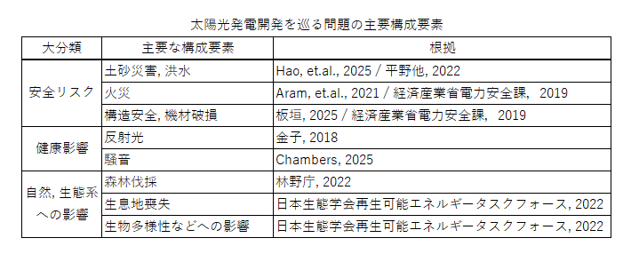
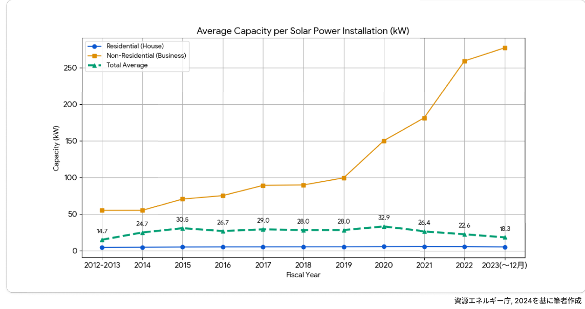
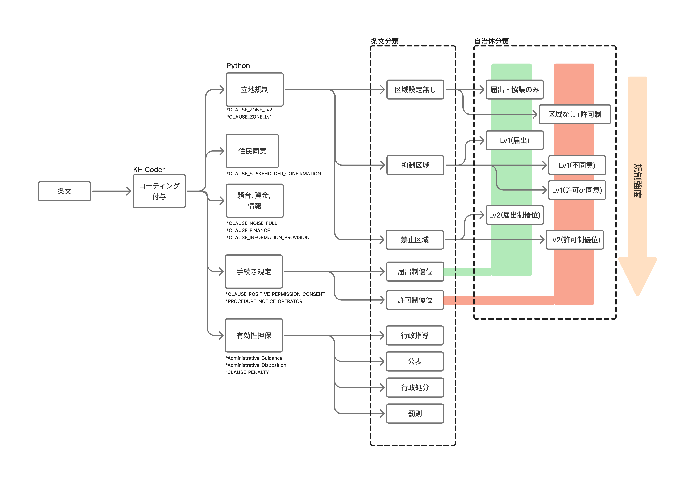
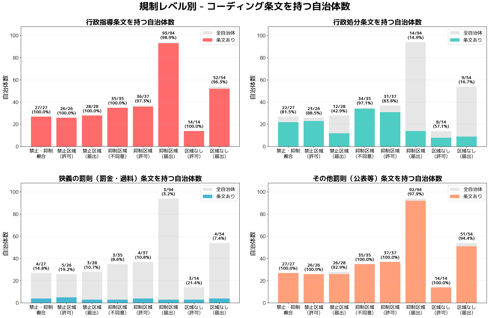
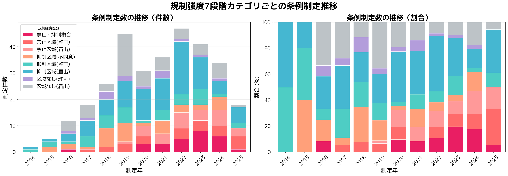
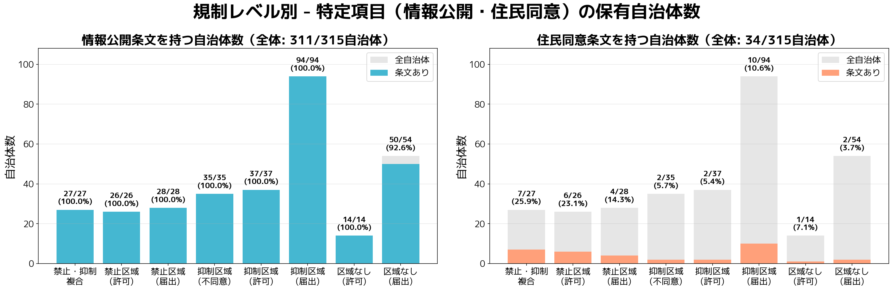

# レポート

チェックボックス: No

# タイトル

## 1 分析の目的と研究の問い

全国の太陽光発電規制条例の条文のテキスト部分を題材に, 2回のテキスト分析を行う. 1回目はKHCoderを利用した計量テキスト分析であり, 各条文が持つ課題テーマを分類する. 次に, 2回目のテキスト分析はPythonを利用した分析であり, 各テーマの具体的な規定方法についてさらに分類を行う. 

この様な分類手法の確立は, 条例の理解を比較的用意にすると考えられる. 特定のテーマについて規定を行っている自治体や, 該当する条文の抽出を行うことによって, 行政, 市民, 事業者, 研究者といった各ステークホルダーが条例を分析する際の橋頭堡となる手法となることを目指す. 

本稿では, いくつかのテーマに絞って条例の規制手法の類型を作成する. これによって, 地域にとって望ましい規制のあり方を明らかにすることを目的としている. 

## 2 研究の背景

### 2.1 大規模太陽光発電における問題

近年, 大規模な太陽光発電開発が問題となっている. 毎日新聞が2021年に'太陽光発電が『公害』'(高橋他, 2021)と報じて以降, 新聞各社でも大規模太陽光発電の自然環境への影響などが報じられるようになった(日本経済新聞, 2025など). 2025年には, 釧路湿原周辺において工事が進められている大規模太陽光発電も大きく報道された(奈良山，2025 / 日本経済新聞社，2025).
太陽光発電事業が生む可能性がある問題は大まかにわけて, 1) 安全リスク, 2) 健康影響, 3) 自然・生態系への影響, の3つに分類できる. **表()** にそれぞれの主要構成要素を示す. SNSにおける議論を分析した研究では, 最も多くみられた争点は'環境破壊'であった(Doedt, [et.al](http://et.al/)., 2023)ため, より注目度の高い構成要素は 3) 自然・生態系への影響であると言える. その一方で, 1) 安全リスクや 2) 健康影響は周辺住民の生活品質に大きく関わるだけでなく, 命の危険性にもつながるため, 決して無視できない構成要素である.



この背景には非住宅用太陽光発電事業の規模が大きく増加していることがある. **図()** に示したように, 2019年以降事業用太陽光発電事業の1件あたり発電機容量が急激に増加していることが指摘できる.



### 2.2 地方自治体による条例の制定

このような状況を受けて, 地方自治体において太陽光発電規制条例(自治体によって正式名称は異なるが, 本稿では一貫して'太陽光発電規制条例'を使用する. )の制定が進んでいる. 地方自治体研究機構(2025)によると, 2025年9月26日時点で322条例が制定されており, 全国の1,718市町村(北方領土の6村を含まない)(総務省, 2018)のうち19%が太陽光発電規制条例を制定していることになる.

./ ただ, 規制条例の実効性には疑問が残されている.
./ 規制条例の内容も様々であり, 混乱を生んでいる.

## 3 先行研究

太陽光発電規制条例が最初に制定されたのは2014年であり(地方自治体研究機構, 2025), 歴史が浅い制度であるため研究も少ない. 先行研究の多くは太陽光発電規制条例の分類基準を示している. 例えば, 上河原他(2020)は規制内容を 1) 2-3区画に分けて規制する方式 2) 特定区域を設定してその部分のみを規制する方式 3) 市域全体を規制する方式の3類型に分類した. また, それぞれの類型において, 各自治体の規制内容を**表()貼り付け!** にまとめている. 特筆すべきは, ‘立地規制の態様’, ‘制裁’, ‘区域’, ‘住民説明規定’の4点である. 地方自治体研究機構(2025)は, 全国322の条例について分析を行っており, ‘対象地域, 対象施設と規制手続’によって12の類型に分類している. 加えて, その他特筆すべき課題テーマとして, 住民説明, 同意, (住民との)協定, 適正管理, 事業廃止後の処分, 処分費用の確保・積立, 実効性確保, 罰則をまとめている. 本稿におけるコーディングルールの作成にあたってはこれらの文献を参考にした. 

条例の効果を測定する研究も見られる. 例えば小島(2018)は初期事例116件[^1]の分析を行っており, 自治体へのアンケート調査も行っている. その結果, 立地状況の把握, 景観保全, 事業者による事前配慮の3点においては条例の運用効果があったと捉えられている一方, 立地規制・誘導においては条例の運用効果が薄いと捉えられていることがわかった. 本田他(2024)は, 太陽光規制条例の有無とPV導入パネルデータを使用して, 規制条例の制定が開発量に与える影響を測定している. その結果, 太陽光発電規制条例の存在は2000kW以下のPV導入量に負の影響があるとした. 

[^1]: 景観法に委任する形式の自治体を含む. 本稿では分析対象外である.

## 4 具体的な論点の抽出

分析項目

- 立地規制(抑制区域, 禁止区域)
- 手続き規定(首長同意, 届け出)
- 有効性担保
    - 行政指導
    - 行政処分
    - 公表
    - 罰則
- その他
    - 住民同意規定
    - 情報公開
    - 騒音防止
    - 資金計画

## 5 分析方法

使用するテキストは, 各自治体の太陽光発電規制条例の条例と施行規則である. 2025年までに制定された322条例(地方自治体研究機構, 2025)のうち, 条文を取得できた315条例とその施行規則295件を対象とした. HTML形式で提供されているものについては, BeautifulSoupを使用してテキスト抽出を行った. PDF形式のものについては, OCR処理を用いてテキストデータを取得した.

テキストは分析の前にフォーマットを揃える処理を行った. (1) 1つの条・項につき1段落とした. KH Coderでは改行によって段落を認識するため, 条・項が変わると判定された部分で改行を行った. 号については改行を排した. (2) 括弧内の句点は削除した. KH Coderは文の認識に句点を使用する. そのため, 括弧内の句点が, 括弧外の文を分断する問題が発生し, これを排除するために括弧内の句点は削除することとした. 

分析には, KH Coderを使用した. 独自にコーディングルールを設定し, 区域設定・協議・届出・許可・罰則・その他複数に関連するキーワードを抽出して分類した. コーディングルールについては抜粋して以下に示す(**表()** ). 

### 表(): コーディングルール一覧

| コード名 (Title) | 定義・説明 (Description) | 代表的な抽出語 (Keywords) |
| :--- | :--- | :--- |
| **\*CLAUSE_POSITIVE_PERMISSION_CONSENT** | 首長（市長・村長等）による許可、承認、同意の決定 | 許可, 承認, 同意, 認可 |
| **\*CLAUSE_PENALTY** | 違反時の罰則、過料、および氏名公表に関する規定 | 罰則, 罰金, 公表, 過料 |
| **\*Disposition** | 行政による命令や処分の執行、または許可の取り消し | 行政処分, 命令, 取消, 命ずる |
| **\*Admin** | 条例の主体となる行政機関や役職 | 市長, 知事, 委員会, 局長 |
| **\*Guidance** | 行政による指導、助言、協力要請などの法的拘束力の弱い働きかけ | 行政指導, 勧告, 助言, 指導 |
| **\*Administrative_Guidance** | 行政機関による指導や勧告（\*Admin と \*Guidance の組み合わせ） | (複合条件のため単語なし) |
| **\*Administrative_Disposition** | 行政機関による処分や命令（\*Admin と \*Disposition の組み合わせ） | (複合条件のため単語なし) |
| **\*CLAUSE_ZONE_Lv1** | 設置を抑制または制限する区域（保全・抑制エリア） | 抑制区域, 制限区域, 保全地区 |
| **\*CLAUSE_ZONE_Lv2** | 設置を原則禁止する区域 | 禁止区域, 禁止地区 |
| **\*CLAUSE_ENVIRONMENT** | 事業が影響を及ぼす可能性のある自然環境や生活環境の要素 | 景観, 生態系, 騒音, 水質, 濁水 |
| **\*CLAUSE_Reflection** | 太陽光パネルの反射光、まぶしさ、および色彩景観への配慮 | 反射光, まぶしさ, 色彩, 黒色 |
| **\*CLAUSE_INFORMATION_PROVISION** | 情報公開、縦覧、パブリックコメントなど、情報の透明性確保 | 縦覧, 公告, パブリックコメント, 意見書 |
| **\*CLAUSE_FINANCE** | 事業の資金計画、撤去費用の積立、および資力信用 | 資金計画, 積立, 撤去費用, 負担金 |
| **\*CLAUSE_NOISE_FULL** | 設備（パワコン等）や工事に起因する騒音・振動・低周波音 | 騒音, 振動, 低周波音, パワーコンディショナー |
| **\*MODAL_PROHIBIT** | 禁止を表す文法表現 | してはならない, 禁止する |
| **\*MODAL_MUST** | 義務を表す文法表現 | しなければならない, 義務 |
| **\*MODAL_SHOULD** | 努力義務や配慮を表す文法表現 | 努める, 配慮する, 望ましい |
| **\*PROCEDURE_NOTICE_OPERATOR** | 事業者から行政への報告、届出等のアクション | 報告, 届出, 連絡 |
| **\*PROCEDURE_TIMING** | 手続きを行う時期や期限（着手前、完了後など） | 事前, 着手前, 期限, 日まで |
| **\*CONFIRMATION** | 関係者からの同意や承諾の取得 | 同意, 承諾, 同意書 |
| **\*STAKEHOLDER** | 住民に加え、自治会、区長などを含む広義の利害関係者 | 自治会, 区長, 周辺関係者, 土地所有者 |
| **\*CLAUSE_STAKEHOLDER_CONFIRMATION** | 利害関係者からの同意取得（\*STAKEHOLDER と \*CONFIRMATION の組み合わせ） | (複合条件のため単語なし) |
| **\*Coverage** / **\*Coverage_Units** | 条例の適用対象となる出力規模や面積 | 出力, キロワット(kW), 面積, 平方メートル |




KH Coderによるコーディング付与を基にして, 条文分類の決定と自治体分類付与をPythonを用いて行った. 分類フローを**図()** に示す. 分析の基礎となる自治体分類は立地規制と手続き規定の組み合わせによって決定した. 立地規制とはゾーニングとも表現される規制手法で, 


## 結果

### 数的結果






### 条文分析

## 考察

```json
どの条文が開発の促進や抑制に, 強い影響を与えるのか. 
比較目録表, データベースの開発

条文の効率的な検索方法の提案
開発の抑制に強い影響を与える項目について, 各自治体の規制条例について評価した一覧表を作成する.

 全国の条例の条文を、開発促進、開発規制に影響をおよぼす重要項目について、全国の条例の比較表をつくる。自治体関係者、政策関係者が、自治体の条例の条文を検索する場合の検索データベースの入口となる比較表を作る。これにより、開発規制の重要項目について、項目をクリックすれば、関連する条例の実例の条文が、検索できるシステムを作ることは、乱開発規制に資すると思う。
 
 特定の規制項目についての条文を抽出できるプラットフォームの形成. 
 
```

## おわりに

## 参考文献

Takahashi, 高橋祐貴・古屋敷尚子・岡大介，2021，「再考エネルギー：太陽光発電が『公害』（その1）自然破壊・景観悪化　37府県でトラブル」『毎日新聞』6月28日東京朝刊，(1)．

Nikkei, 日本経済新聞社，2025a，「［社説］地域と共生する太陽光発電に」『日本経済新聞』10月12日．

Nikkei, 日本経済新聞社，2025b，「メガソーラーに自治体苦心　環境調和巡り事業者と摩擦　規制条例、強制力に限界」『日本経済新聞』2025年9月14日朝刊．

Narayama, 奈良山雅俊，2025，「釧路、自然と調和しない太陽光発電にNO　予定地でワシ繁殖、業者が一部中止」『朝日新聞』2025年6月19日夕刊，環境，4面．

Hao, Kazuki, Dimiter Ialnazov, and Yosuke Yamashiki, 2021, "GIS Analysis of Solar PV Locations and Disaster Risk Areas in Japan," Frontiers in Sustainability, 2: 815986 ([https://www.frontiersin.org/journals/sustainability/articles/10.3389/frsus.2021.815986/pdf](https://www.frontiersin.org/journals/sustainability/articles/10.3389/frsus.2021.815986/pdf) 2025-12-02).

Aram, Monireh, Xin Zhang, Dahai Qi, and Yoon Ko, 2021, "A state-of-the-art review of fire safety of photovoltaic systems in buildings," Journal of Cleaner Production, 308: 127239 ([https://www.sciencedirect.com/science/article/pii/S095965262101458X](https://www.sciencedirect.com/science/article/pii/S095965262101458X) 2025-12-02).

Hirano, 平野徹・上坂善孝，2022，「太陽光発電所の土砂災害リスク」『損保ジャパンRMレポート』232（[https://image.sompo-rc.co.jp/reports/r232.pdf](https://image.sompo-rc.co.jp/reports/r232.pdf) 2025年12月2日取得）．

Itagaki, 板垣勝彦，2025，「太陽光パネル規制条例の現在地――山梨県太陽光発電施設の適正な設置及び維持管理に関する条例の分析」『横浜国際社会科学研究』33(2): 175-207（[https://ynu.repo.nii.ac.jp/record/2001520/files/33-2_10.pdf](https://ynu.repo.nii.ac.jp/record/2001520/files/33-2_10.pdf) 2025年12月2日取得）

Meti, 経済産業省電力安全課，2019，「再エネ発電設備の導入拡大に伴う電気保安の現状と課題」産業構造審議会保安・消費生活用製品安全分科会電力安全小委員会新エネルギー発電設備事故対応・構造強度ワーキンググループ（第18回）配布資料（資料1-1）（[https://www.meti.go.jp/shingikai/sankoshin/hoan_shohi/denryoku_anzen/newenergy_hatsuden_wg/pdf/018_01_01.pdf](https://www.meti.go.jp/shingikai/sankoshin/hoan_shohi/denryoku_anzen/newenergy_hatsuden_wg/pdf/018_01_01.pdf) 2025年12月2日取得）．

Chambers, Terrence L. and Shahab Mehraeen, 2025, "A Brief Study of the Acoustic Impacts of Solar Power Generation Facilities," University of Louisiana at Lafayette ([https://eese.louisiana.edu/sites/eese/files/A Brief Study of the Acoustic Impacts of Solar Power Generation Facilities.pdf](https://eese.louisiana.edu/sites/eese/files/A%20Brief%20Study%20of%20the%20Acoustic%20Impacts%20of%20Solar%20Power%20Generation%20Facilities.pdf) 2025-12-02).

Kaneko, 金子憲治，2018，「『メガソーラーの反射光で熱中症！？』、姫路訴訟のてん末」『日経クロステック（xTECH）』5月16日（[https://xtech.nikkei.com/dm/atcl/feature/15/302961/051000081/](https://xtech.nikkei.com/dm/atcl/feature/15/302961/051000081/) 2025年12月2日取得）．

Chihouzititaikennkyuukikou, 一般財団法人地方自治研究機構，2025，「太陽光発電設備の規制に関する条例」『法制執務支援』（[https://www.rilg.or.jp/htdocs/img/reiki/005_solar.htm](https://www.rilg.or.jp/htdocs/img/reiki/005_solar.htm) 2025年12月2日取得）．

MIC, 総務省，2018，「市町村合併」『総務省ウェブサイト』（[https://www.soumu.go.jp/kouiki/kouiki.html](https://www.soumu.go.jp/kouiki/kouiki.html) 2025年12月2日取得）．

Forestry Agency, 林野庁, 2022,「太陽光発電に係る林地開発をめぐる現状と課題」（太陽光発電に係る林地開発許可基準に関する検討会 資料4－1）林野庁ホームページ([https://www.rinya.maff.go.jp/j/tisan/tisan/attach/pdf/con_4_6_1-30.pdf](https://www.rinya.maff.go.jp/j/tisan/tisan/attach/pdf/con_4_6_1-30.pdf), 2025年12月2日取得).

Nihonseitaigakkai, 日本生態学会再生可能エネルギータスクフォース, 2022, 「再生可能エネルギーの推進と生態系・生物多様性保全に関するガイドライン（第1版）」日本生態学会ホームページ([https://www.esj.ne.jp/esj/message/07yumoto/no0709_Ver1.pdf](https://www.esj.ne.jp/esj/message/07yumoto/no0709_Ver1.pdf), 2025年12月2日取得).

Honda, 本田さはら・竹内憲司，2024，「太陽光発電施設規制条例の効果に関する実証研究」環境経済・政策学会2024年大会（関西大学，9月14日）．
