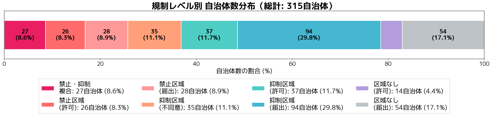
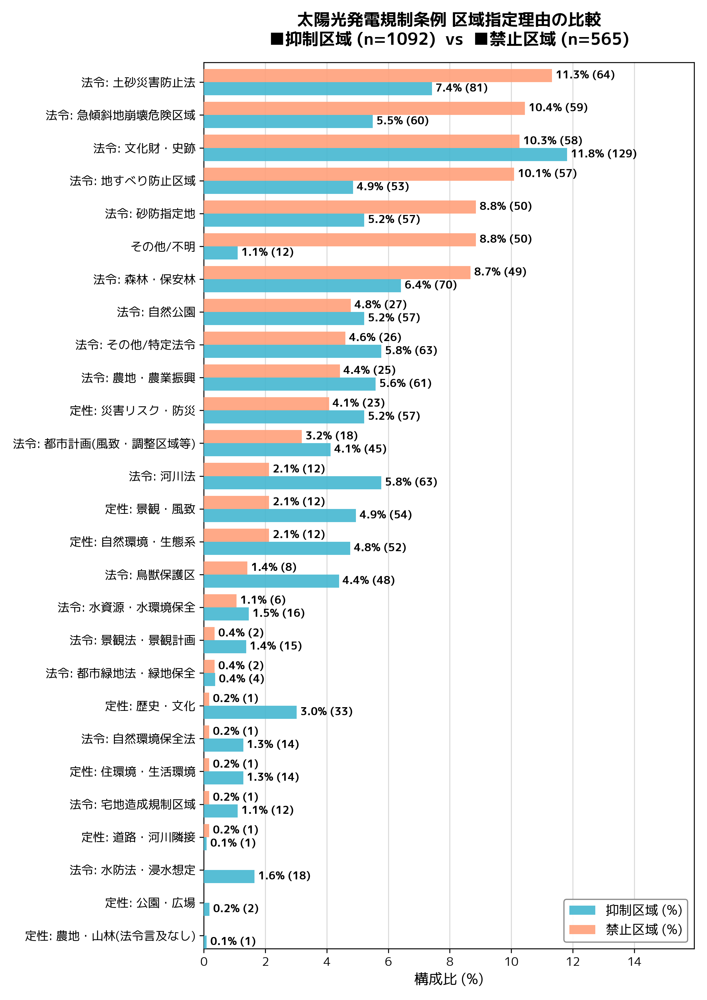

# レポート

チェックボックス: No

# タイトル

## 1 分析の目的と研究の問い

本稿では、全国の自治体で制定されている太陽光発電規制条例（以下、規制条例）の条文を対象に、テキストマイニングを用いた定量的な分析を行う。

具体的には、以下の2段階の分析を実施する。

1. **計量テキスト分析（KH Coder）**: 各条文が内包する課題テーマ（景観、安全、手続き等）を抽出し、大まかな分類を行う。  
2. **詳細分類（Python）**: 抽出された各テーマが、具体的にどのような強度や手法で規定されているかを掘り下げる。

こうした分類手法の確立は、複雑化する条例の構造を理解する上で極めて有効である。特定のテーマについて先進的な規定を持つ自治体や、参考となる条文を効率的に抽出可能にすることで、行政担当者、市民、事業者、研究者といった各ステークホルダーが条例を分析・検討する際の強固な基盤（橋頭堡）を提供することを目指す。

最終的には、いくつかの主要なテーマに絞って規制手法の類型化を行い、地域社会にとって望ましい規制のあり方を明らかにすることを目的とする。

## 2 研究の背景

### 2.1 大規模太陽光発電における問題

近年、非住宅用（事業用）を中心とした大規模な太陽光発電開発が各地で軋轢を生んでいる。毎日新聞が2021年に「太陽光発電が『公害』」（高橋他, 2021）と報じて以降、新聞各社でも自然環境への悪影響や地域トラブルが頻繁に取り上げられるようになった（日本経済新聞, 2025など）。2025年には、釧路湿原周辺で進められていた大規模開発が大きく報道され、社会的な関心を集めている（奈良山, 2025; 日本経済新聞社, 2025）。

太陽光発電事業が引き起こす懸念は、大きく以下の3点に分類できる（**表1**）。

1. **安全リスク**: 土砂災害や設備の損壊など  
2. **健康影響**: 反射光や騒音などによる住環境の悪化  
3. **自然・生態系への影響**: 森林伐採や生物多様性の喪失

SNS上の議論分析では「環境破壊」への懸念が最も多く見られるが（Doedt et al., 2023）、安全リスクや健康影響は周辺住民の生命・財産に直結するため、これらも決して看過できない重要な要素である。

こうした問題の背景には、事業規模の拡大がある。**図1**に示す通り、2019年以降、事業用太陽光発電の1件あたりの発電容量は急激な増加傾向にあり、これが地域環境への負荷を高める要因となっている。

### 2.2 地方自治体による条例の制定

開発に伴うトラブルに対処するため、多くの地方自治体が独自に規制条例の制定を進めている。地方自治体研究機構（2025）によれば、2025年9月26日時点で322の条例が確認されており、これは全国1,718市町村（北方領土を除く）の約19%に相当する。

しかし、条例の内容は自治体によって千差万別であり、その実効性には疑問も残る。規制の乱立は事業者にとっての予見可能性を低下させる一方で、実効性の乏しい条例は住民の不安を解消できないというジレンマがあり、現状は混乱が生じていると言わざるを得ない。

## 3 先行研究
規制条例に関する研究は、制度の歴史が浅いこともあり発展途上にある。既存の研究は主に「類型の整理」と「効果の検証」の2つに大別できる。

### **3.1 規制内容の類型化**

先行研究の多くは、条例の分類基準の提示を試みている。

* **上河原他（2020）**: 規制区域のあり方に着目し、(1)ゾーニング規制（2-3区分）、(2)特定区域のみの規制、(3)市域全体の規制、の3類型を提示した。また、立地規制の態様、制裁、区域、住民説明規定などを整理している。  
* **地方自治体研究機構（2025）**: 全国322条例を対象に、「対象地域・対象施設・規制手続」の観点から12類型に分類した上で、同意、協定、適正管理、廃止後措置、罰則などの論点を網羅的にまとめている。

本稿のコーディングルール作成にあたっては、これらの分類軸を基礎とした。

### **3.2 条例の効果測定**

条例が実際に開発を抑制・誘導できているかを検証した研究も見られる。

* **小島（2018）**: 初期事例116件（景観法委任型を含む）を分析し、景観保全や事前配慮には効果があったとする一方、立地規制・誘導そのものの効果は限定的であると指摘している。  
* **本田他（2024）**: パネルデータを用いた定量分析を行い、規制条例の存在が2000kW以下の太陽光発電導入に対して負の影響（抑制効果）を持つことを明らかにしている。

## 4 具体的な論点の抽出

### 4.1 分析項目

先行研究および現状の課題を踏まえ、本稿では以下の項目を主要な論点として抽出し、分析対象とする。

* **立地規制（ゾーニング）**: 抑制区域や禁止区域の設定有無  
* **許可・同意**: 首長による許可権限や同意の要否  
* **有効性担保・処分**:  
  * 行政指導、勧告  
  * 行政処分（命令、取消）  
  * 氏名公表  
  * 罰則（過料等）  
* **その他項目**:  
  * 住民同意・説明会  
  * 情報公開プロセス  
  * 騒音規制
  * 廃棄・リサイクル

### 4.2 立地規制の考え方

立地規制は、太陽光発電規制条例を設計するうえで最も基礎的かつ重要な要素である。一般にゾーニングとも呼ばれ、その具体的な設定方法については上河原他（2020）を参照されたい。本分析では、規制強度を測定する指標のひとつとして用いるため、禁止区域および抑制区域が設定されているか否かに着目する。

禁止区域とは、原則として設備の設置を認めない区域（設置禁止区域）である。他方、抑制区域は、たとえば「事業を実施しないよう事業者に協力を求めるものとする（五條市）」とされる区域であり、設置を全面的に禁止するものではないものの、事業者に対して設置の回避・抑制を要請する点に特徴がある。

### 4.3 許可・同意の考え方

条例における許可・同意の規定は、事業の開始段階で自治体の関与を可能にする重要な手段である。許可制を採用する場合、事業者は設備設置前に首長等の許可を取得する必要があり、これにより自治体は事業内容や立地条件を審査・調整できる。

### 4.4 有効性担保・処分の考え方

## 5 分析方法

分析対象は、2025年までに制定された規制条例およびその施行規則である。地方自治体研究機構（2025）がリストアップした322条例のうち、条文データが取得可能であった315条例および施行規則295件を使用した。  
データ収集には以下の手法を用いた。

* **HTML形式**: BeautifulSoupライブラリを用いてテキスト抽出を実施。  
* **PDF形式**: OCR処理を行いテキスト化を実施。

### 5.2 前処理（プリプロセッシング）

分析精度を高めるため、テキストデータに対して以下の統一処理を行った。

1. **段落の正規化**: KH Coderの仕様に合わせ、1つの「条・項」を1段落として扱った。「号」による改行は削除し、文脈の分断を防いだ。  
2. **不要記号の削除**: 括弧内の句点は、一文の区切りとして誤認識されるのを防ぐため削除した。

### 5.3 分析手法

分析には計量テキスト分析ツール「KH Coder」および「Python」を使用した。  
先行研究を参考に独自のコーディングルール（表2）を設定し、区域設定、協議、届出、許可、罰則などに関連するキーワードを抽出・分類した。  

### 表(): コーディングルール一覧

| コード名 (Title) | 定義・説明 (Description) | 代表的な抽出語 (Keywords) |
| :--- | :--- | :--- |
| **\*CLAUSE_POSITIVE_PERMISSION_CONSENT** | 首長（市長・村長等）による許可、承認、同意の決定 | 許可, 承認, 同意, 認可 |
| **\*CLAUSE_PENALTY** | 違反時の罰則、過料、および氏名公表に関する規定 | 罰則, 罰金, 公表, 過料 |
| **\*Disposition** | 行政による命令や処分の執行、または許可の取り消し | 行政処分, 命令, 取消, 命ずる |
| **\*Admin** | 条例の主体となる行政機関や役職 | 市長, 知事, 委員会, 局長 |
| **\*Guidance** | 行政による指導、助言、協力要請などの法的拘束力の弱い働きかけ | 行政指導, 勧告, 助言, 指導 |
| **\*Administrative_Guidance** | 行政機関による指導や勧告（\*Admin と \*Guidance の組み合わせ） | (複合条件のため単語なし) |
| **\*Administrative_Disposition** | 行政機関による処分や命令（\*Admin と \*Disposition の組み合わせ） | (複合条件のため単語なし) |
| **\*CLAUSE_ZONE_Lv1** | 設置を抑制または制限する区域（保全・抑制エリア） | 抑制区域, 制限区域, 保全地区 |
| **\*CLAUSE_ZONE_Lv2** | 設置を原則禁止する区域 | 禁止区域, 禁止地区 |
| **\*CLAUSE_ENVIRONMENT** | 事業が影響を及ぼす可能性のある自然環境や生活環境の要素 | 景観, 生態系, 騒音, 水質, 濁水 |
| **\*CLAUSE_Reflection** | 太陽光パネルの反射光、まぶしさ、および色彩景観への配慮 | 反射光, まぶしさ, 色彩, 黒色 |
| **\*CLAUSE_INFORMATION_PROVISION** | 情報公開、縦覧、パブリックコメントなど、情報の透明性確保 | 縦覧, 公告, パブリックコメント, 意見書 |
| **\*CLAUSE_FINANCE** | 事業の資金計画、撤去費用の積立、および資力信用 | 資金計画, 積立, 撤去費用, 負担金 |
| **\*CLAUSE_NOISE_FULL** | 設備（パワコン等）や工事に起因する騒音・振動・低周波音 | 騒音, 振動, 低周波音, パワーコンディショナー |
| **\*MODAL_PROHIBIT** | 禁止を表す文法表現 | してはならない, 禁止する |
| **\*MODAL_MUST** | 義務を表す文法表現 | しなければならない, 義務 |
| **\*MODAL_SHOULD** | 努力義務や配慮を表す文法表現 | 努める, 配慮する, 望ましい |
| **\*PROCEDURE_NOTICE_OPERATOR** | 事業者から行政への報告、届出等のアクション | 報告, 届出, 連絡 |
| **\*PROCEDURE_TIMING** | 手続きを行う時期や期限（着手前、完了後など） | 事前, 着手前, 期限, 日まで |
| **\*CONFIRMATION** | 関係者からの同意や承諾の取得 | 同意, 承諾, 同意書 |
| **\*STAKEHOLDER** | 住民に加え、自治会、区長などを含む広義の利害関係者 | 自治会, 区長, 周辺関係者, 土地所有者 |
| **\*CLAUSE_STAKEHOLDER_CONFIRMATION** | 利害関係者からの同意取得（\*STAKEHOLDER と \*CONFIRMATION の組み合わせ） | (複合条件のため単語なし) |
| **\*Coverage** / **\*Coverage_Units** | 条例の適用対象となる出力規模や面積 | 出力, キロワット(kW), 面積, 平方メートル |

その後、KH Coderによるコーディング結果（フラグ付け）に基づき、Pythonを用いて各条例の性質決定と自治体分類を行った。分析のフローを**図2**に示す。

**規制レベル**は、全自治体を「立地規制（ゾーニング）の有無」と「許可・同意の要否」の2軸で整理し、8段階に分類する。たとえば、禁止区域を設定している自治体であっても、許可制を採用する自治体と採用しない自治体が存在するため、両者を区別することで規制強度の差異をより明確にできる。

また、禁止区域と抑制区域を併用する自治体（禁止・抑制複合）もみられる。この類型には許可制[^1]と届出制[^2]の2種類が確認できるが、本分析では分類が過度に細分化されることを避け、同一カテゴリとして扱うこととした。

[^1]: 丸森町、八幡平市、北斗市など。丸森町は、抑制区域内であっても首長不同意が規定されており珍しい。
[^2]: つくば市、五條市など。

## 6 結果

### 6.1 数的結果

### 6.2 条文分析

## 7 考察：条例データベースの構築に向けて

本研究の分析を通じて、規制条例の多様性と、その中に潜む一定のパターンが明らかになった。ここでは、この分析結果の社会的活用について考察する。

### 7.1 開発抑制・促進要因の特定

本分析により、どの条文や規定の組み合わせが開発の抑制（あるいは適正な誘導）に強い影響を与えるかが可視化された。特に「禁止区域の設定」と「罰則付きの許可制」を併用している自治体において、規制の実効性が高まる可能性が示唆される。この知見は、今後条例を制定・改正しようとする自治体にとって重要な指針となる。

### 7.2 効率的な検索・比較プラットフォームの提案

現状、条例情報は各自治体のウェブサイトに散在しており、比較検討が困難である。本研究で用いたテキストマイニングの手法を応用することで、以下のような機能を持つ「条例比較データベース」の構築が可能であると考える。

1. **比較目録表の作成**: 全国の条例について、開発規制に影響を及ぼす重要項目（罰則、住民同意、撤去費用積立など）の有無を一覧化した比較表を作成する。  
2. **条文検索システム**: 「資金計画」や「景観配慮」といった特定のタグをクリックすることで、該当する条文の実例を即座に抽出・比較できるインターフェースを提供する。

こうしたプラットフォームは、自治体職員や政策立案者が、他自治体の先行事例（ベストプラクティス）を効率的に参照することを助けるだけでなく、乱開発防止に向けた広域的な連携の基盤となり得る。行政、市民、研究者が共通のデータに基づいて議論できる環境を整えることは、持続可能な再生可能エネルギー導入への第一歩である。

## おわりに

## 参考文献

Takahashi, 高橋祐貴・古屋敷尚子・岡大介，2021，「再考エネルギー：太陽光発電が『公害』（その1）自然破壊・景観悪化　37府県でトラブル」『毎日新聞』6月28日東京朝刊，(1)．

Nikkei, 日本経済新聞社，2025a，「［社説］地域と共生する太陽光発電に」『日本経済新聞』10月12日．

Nikkei, 日本経済新聞社，2025b，「メガソーラーに自治体苦心　環境調和巡り事業者と摩擦　規制条例、強制力に限界」『日本経済新聞』2025年9月14日朝刊．

Narayama, 奈良山雅俊，2025，「釧路、自然と調和しない太陽光発電にNO　予定地でワシ繁殖、業者が一部中止」『朝日新聞』2025年6月19日夕刊，環境，4面．

Hao, Kazuki, Dimiter Ialnazov, and Yosuke Yamashiki, 2021, "GIS Analysis of Solar PV Locations and Disaster Risk Areas in Japan," Frontiers in Sustainability, 2: 815986 ([https://www.frontiersin.org/journals/sustainability/articles/10.3389/frsus.2021.815986/pdf](https://www.frontiersin.org/journals/sustainability/articles/10.3389/frsus.2021.815986/pdf) 2025-12-02).

Aram, Monireh, Xin Zhang, Dahai Qi, and Yoon Ko, 2021, "A state-of-the-art review of fire safety of photovoltaic systems in buildings," Journal of Cleaner Production, 308: 127239 ([https://www.sciencedirect.com/science/article/pii/S095965262101458X](https://www.sciencedirect.com/science/article/pii/S095965262101458X) 2025-12-02).

Hirano, 平野徹・上坂善孝，2022，「太陽光発電所の土砂災害リスク」『損保ジャパンRMレポート』232（[https://image.sompo-rc.co.jp/reports/r232.pdf](https://image.sompo-rc.co.jp/reports/r232.pdf) 2025年12月2日取得）．

Itagaki, 板垣勝彦，2025，「太陽光パネル規制条例の現在地――山梨県太陽光発電施設の適正な設置及び維持管理に関する条例の分析」『横浜国際社会科学研究』33(2): 175-207（[https://ynu.repo.nii.ac.jp/record/2001520/files/33-2_10.pdf](https://ynu.repo.nii.ac.jp/record/2001520/files/33-2_10.pdf) 2025年12月2日取得）

Meti, 経済産業省電力安全課，2019，「再エネ発電設備の導入拡大に伴う電気保安の現状と課題」産業構造審議会保安・消費生活用製品安全分科会電力安全小委員会新エネルギー発電設備事故対応・構造強度ワーキンググループ（第18回）配布資料（資料1-1）（[https://www.meti.go.jp/shingikai/sankoshin/hoan_shohi/denryoku_anzen/newenergy_hatsuden_wg/pdf/018_01_01.pdf](https://www.meti.go.jp/shingikai/sankoshin/hoan_shohi/denryoku_anzen/newenergy_hatsuden_wg/pdf/018_01_01.pdf) 2025年12月2日取得）．

Chambers, Terrence L. and Shahab Mehraeen, 2025, "A Brief Study of the Acoustic Impacts of Solar Power Generation Facilities," University of Louisiana at Lafayette ([https://eese.louisiana.edu/sites/eese/files/A Brief Study of the Acoustic Impacts of Solar Power Generation Facilities.pdf](https://eese.louisiana.edu/sites/eese/files/A%20Brief%20Study%20of%20the%20Acoustic%20Impacts%20of%20Solar%20Power%20Generation%20Facilities.pdf) 2025-12-02).

Kaneko, 金子憲治，2018，「『メガソーラーの反射光で熱中症！？』、姫路訴訟のてん末」『日経クロステック（xTECH）』5月16日（[https://xtech.nikkei.com/dm/atcl/feature/15/302961/051000081/](https://xtech.nikkei.com/dm/atcl/feature/15/302961/051000081/) 2025年12月2日取得）．

Chihouzititaikennkyuukikou, 一般財団法人地方自治研究機構，2025，「太陽光発電設備の規制に関する条例」『法制執務支援』（[https://www.rilg.or.jp/htdocs/img/reiki/005_solar.htm](https://www.rilg.or.jp/htdocs/img/reiki/005_solar.htm) 2025年12月2日取得）．

MIC, 総務省，2018，「市町村合併」『総務省ウェブサイト』（[https://www.soumu.go.jp/kouiki/kouiki.html](https://www.soumu.go.jp/kouiki/kouiki.html) 2025年12月2日取得）．

Forestry Agency, 林野庁, 2022,「太陽光発電に係る林地開発をめぐる現状と課題」（太陽光発電に係る林地開発許可基準に関する検討会 資料4－1）林野庁ホームページ([https://www.rinya.maff.go.jp/j/tisan/tisan/attach/pdf/con_4_6_1-30.pdf](https://www.rinya.maff.go.jp/j/tisan/tisan/attach/pdf/con_4_6_1-30.pdf), 2025年12月2日取得).

Nihonseitaigakkai, 日本生態学会再生可能エネルギータスクフォース, 2022, 「再生可能エネルギーの推進と生態系・生物多様性保全に関するガイドライン（第1版）」日本生態学会ホームページ([https://www.esj.ne.jp/esj/message/07yumoto/no0709_Ver1.pdf](https://www.esj.ne.jp/esj/message/07yumoto/no0709_Ver1.pdf), 2025年12月2日取得).

Honda, 本田さはら・竹内憲司，2024，「太陽光発電施設規制条例の効果に関する実証研究」環境経済・政策学会2024年大会（関西大学，9月14日）．
